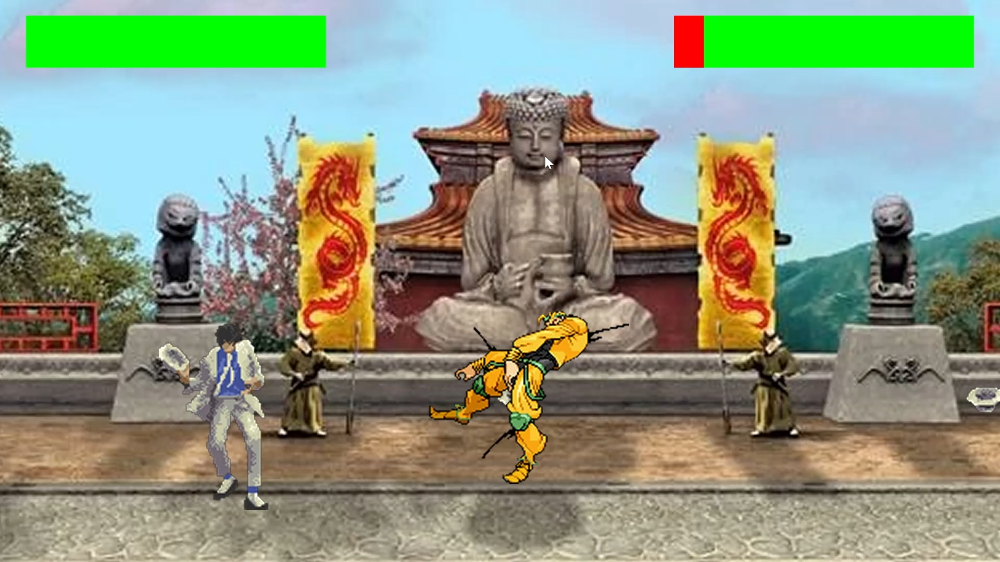
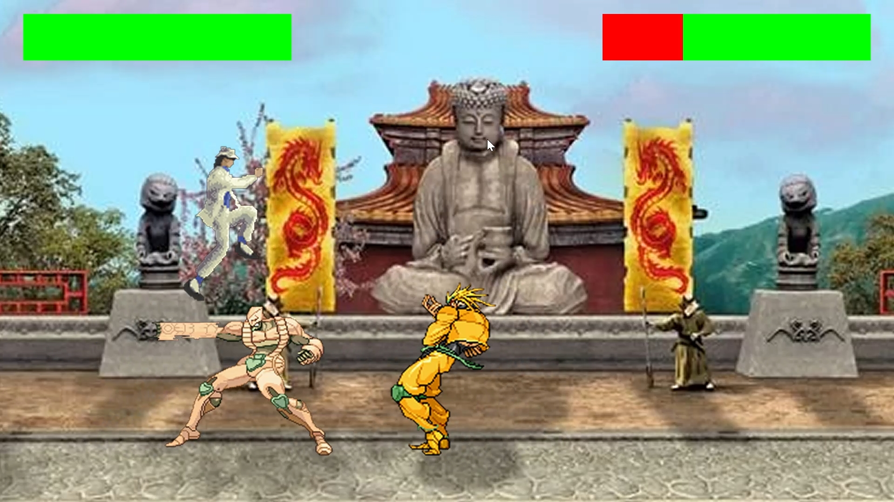
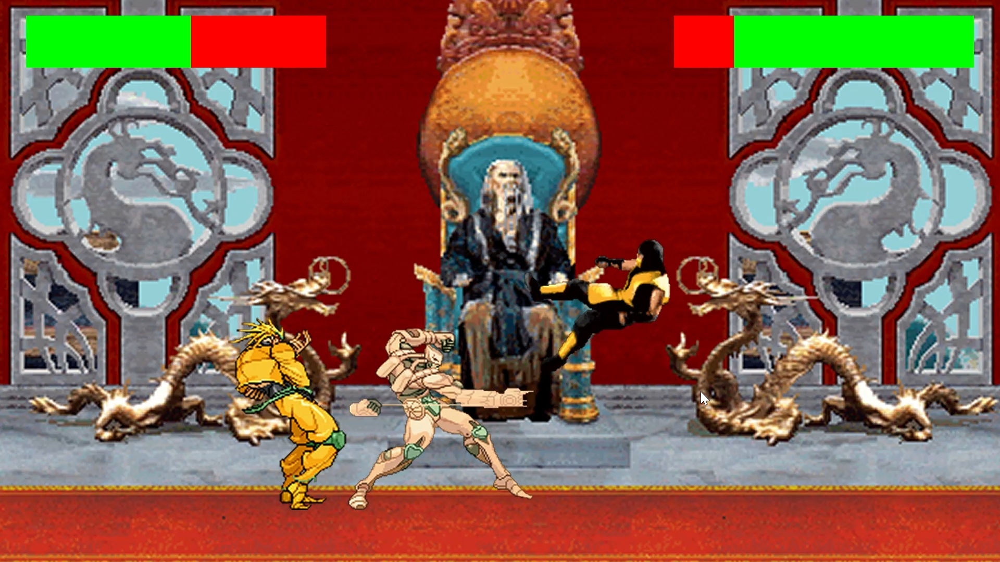

# ISC Kombat
A fun little project, inspired by 90s fighting games

## About the game
### Overview
ISC Kombat is a 2 player fighting game, where both players fight to their death. Only one can come out alive.

### How to play
#### Menu

Both players must select a character for the game to start.

Once characters are selected, the game starts automatically after 5 seconds.

Player 1 and Player 2 selections are represented by Blue and Green Rectangles respectively.

The game contains 3 maps, which are picked randomly. Though they can be manually chosen using the `createStage(name: String): Option[Stage]` method of `StagesLoader`

Xbox Controllers are fully supported in the game. They can be used, by pressing START at any time

You can choose between 4 characters:
* Scorpion
* Johnny Cage
* Dio
* Michael Jackson

### Screenshots and video

## Controls
### Keyboard
| Action / Menu controls          | Player 1 | Player 2    |
|---------------------------------|----------|-------------|
| Jump         / Menu Up          | W        | Arrow Up    |
| Move Right   / Menu Right       | D        | Arrow Right |
| Crouch       / Menu Down        | S        | Arrow Down  |
| Move Left    / Menu Left        | A        | Arrow Left  |
| Punch        / Select Character | T        | P           |
| Block                           | H        | L           |
### Xbox controller
Jump / Menu Up - DPAD Up

Move Right / Menu Right - DPAD Right

Crouch / Menu Down - DPAD Down

Move Left / Menu Left - DPAD Left

Punch / Select Character - X

Block - A

#### How to connect the controller?
After the game launch, press "START" on the controller. It will automatically be assigned to the first available player

## Character Special Moves
### Scorpion
**Get Over Here!** - "&#8592; &#8592; Punch"
### Michael Jackson
**Smooth Criminal** - "&#8595; &#8592; Punch"
### Dio
**MUDA MUDA MUDA MUDA** - "&#x2193; &#x2193; Punch"
### Johnny Cage
**DASH** - "&#8592; &#8592; Punch"